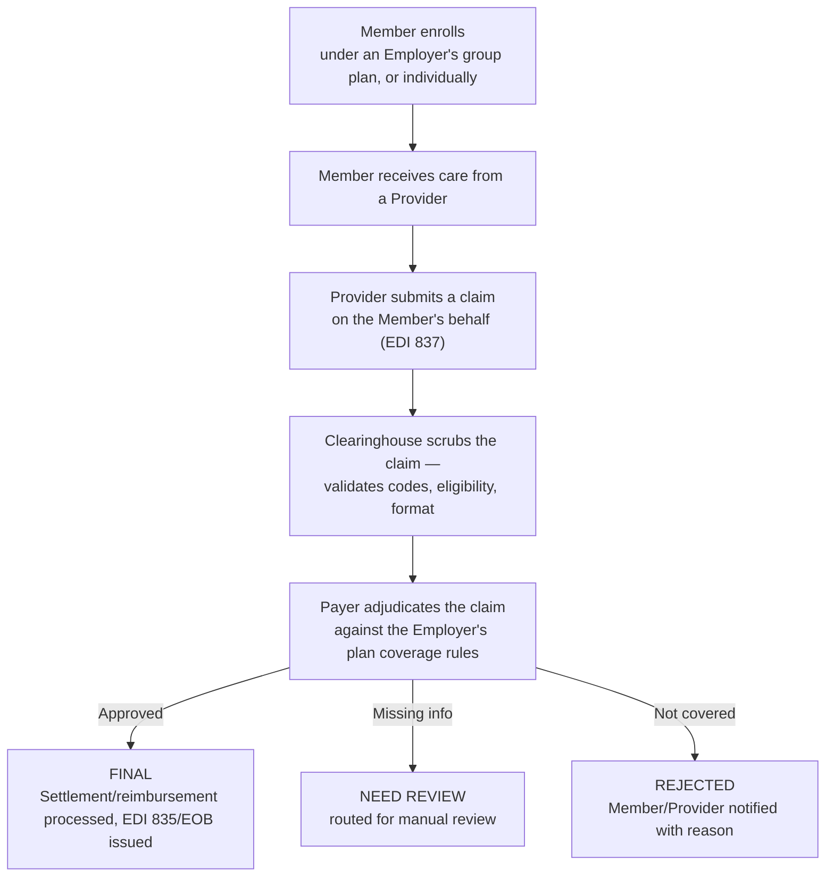

# 🏥 Healthcare Insurance Platform

**A SaaS health insurance claims platform — QA & Automation Portfolio Project**

> This repository documents the QA strategy, test automation, and testing approach applied to a
> **SaaS-based Healthcare Insurance application** — a platform that manages the complete health
> insurance lifecycle across four distinct entity types: Providers, Payers, Employers, and
> Members/Patients.
>
> All content here uses **generic/sample data only**. No client names, company names, or
> confidential/production information are included. Dates and timelines are placeholders —
> update `[Timeline]` before publishing.
>
> 📍 **New here?** [`docs/README.md`](./docs/README.md) is a documentation map answering "what is
> this, how does it work, who's involved, what does it depend on" — with a recommended reading
> order through every doc in this repo.

---

## 📖 Table of Contents

1. [What is a Healthcare Insurance Platform?](#-what-is-a-healthcare-insurance-platform)
2. [My Role](#-my-role)
3. [Tech Stack & Tools Used](#-tech-stack--tools-used)
4. [Types of Testing Performed](#-types-of-testing-performed)
5. [How It Works — Claim Lifecycle](#-how-it-works--claim-lifecycle)
6. [Key Achievements](#-key-achievements)
7. [Automation Approach](#-automation-approach)
8. [Regression Checklist](#-regression-checklist)
9. [Screenshots & Reports](#-screenshots--reports)
10. [Repository Structure](#-repository-structure)

> Deeper dives not covered inline in this README: [Modules, Submodules & Stakeholders](./docs/business-overview.md),
> [Architecture, Flow & Real Sequence Diagrams](./docs/architecture-and-flow.md),
> [Full Tech Stack & Skills Demonstrated](./docs/tech-and-skills.md), [UI Consistency](./docs/ui-consistency.md)
> — see [`docs/README.md`](./docs/README.md) for the full map. **Every diagram in this repo is
> drawn in Mermaid and renders natively right here on GitHub — nothing requires visiting another
> site.**

---

## 💡 What is a Healthcare Insurance Platform?

A **SaaS Healthcare Insurance platform** manages the entire lifecycle of a health insurance
policy — from enrollment through claims processing to billing — across **four distinct entity
types**, each with a different relationship to the insurance process:

| Entity | Who they are |
|---|---|
| **Providers** | Healthcare professionals, dental practitioners, and medical facilities delivering care |
| **Payers** | Insurance companies offering health plans and processing claims/reimbursements |
| **Employers** | Organizations that purchase group insurance plans and provide coverage to employees |
| **Members / Patients** | Individuals enrolled in an insurance plan, accessing healthcare services and benefits |

If you're new to fintech/health-tech QA, HR, or any non-technical role: think of it as a
four-sided marketplace built around one core financial transaction — a **claim**. A Provider
delivers care and submits a claim, a Payer decides whether and how much to pay, an Employer's
plan defines what's covered, and a Member is the person the whole thing is ultimately for. Each
side of this relationship needs its own portal, its own permissions, and its own view of the
same underlying claim data — which is exactly why cross-entity data consistency is the module's
central testing challenge.

### Core Platform Features

- Policy management (plan configuration, coverage rules)
- Claims processing (submission → review → status determination → settlement)
- Enrollment (Employer group plans, individual Member enrollment)
- Billing
- Provider network management
- Regulatory compliance and data accuracy across web and mobile

---

## 👤 My Role

QA Engineer / SDET responsible for end-to-end quality across the Provider/Payer/Employer/Member
claim lifecycle, from requirements through release sign-off.

- **Requirement gathering and analysis** — working closely with the client/product team to
  gather and clarify requirements before test design begins
- **Full-stack functional testing** — hands-on front-end and back-end testing of the web
  application across all four entity portals
- **Healthcare claims domain testing** — strong working knowledge of Provider/Payer/Employer/
  Member-specific features and how a claim moves between them
- **API testing** — performing full CRUD operation validation via API
- **Data-level testing** — validating claims across their different statuses (**Final**, **Need
  Review**, **Rejected**) directly against underlying data, not just UI state
- **Full Agile testing lifecycle** — test scenario and test case preparation for assigned user
  stories, peer review of test cases against review standards, and participation in backlog
  grooming, sprint planning, daily scrum, sprint review, retrospective, and RCA meetings
- **Requirement Traceability Matrix (RTM)** — preparing and maintaining RTM documentation
  linking requirements to test coverage
- **Defect lifecycle ownership** — attending defect triage meetings, reporting defects via JIRA,
  and retesting resolved defects before closure
- **QA sign-off reporting** — preparing end-of-sprint QA sign-off reports and sharing them with
  the team and stakeholders

**Timeline:** `[Add Duration]`

---

## 🛠 Tech Stack & Tools Used

| Category | Tools |
|---|---|
| **UI Automation** | Playwright, TypeScript |
| **API Testing & Automation** | REST Assured, Postman |
| **Data-Level Testing** | SQL (direct claim/status validation) |
| **Performance Testing** | k6 (batch claim-submission throughput, adjudication-queue load) |
| **Bug Tracking & Traceability** | JIRA, RTM (Requirement Traceability Matrix — see [`sample-rtm.md`](./sample-rtm.md)) |
| **Process** | Agile/Scrum |
| **Version Control** | Git, GitHub |

> Full detail on *why* each tool was chosen, a skill → proof map, and the performance testing
> approach in depth: [`docs/tech-and-skills.md`](./docs/tech-and-skills.md).

---

## 🧪 Types of Testing Performed

- **Functional Testing** — full front-end and back-end coverage across all four entity portals
- **API Testing** — complete CRUD operation validation
- **Data-Level Testing** — validating claims across **Final / Need Review / Rejected** statuses
  directly at the data layer, not just what the UI displays
- **Performance Testing** — batch claim-submission throughput and adjudication-queue load,
  validated with k6 (see [`docs/tech-and-skills.md`](./docs/tech-and-skills.md) section 5 for the
  full load/spike/soak approach applied to this specific domain)
- **Regression Testing** — full suite run before every release
- **Smoke & Sanity Testing** — post-deployment health checks
- **Cross-Browser Testing**
- **End-to-End (E2E) Automation**
- **Requirement Traceability** — RTM prepared and maintained per release to confirm every
  requirement has corresponding test coverage (see [`sample-rtm.md`](./sample-rtm.md) for a
  worked example, including how it surfaces real coverage gaps)

---

## 🔄 How It Works — Claim Lifecycle



**Testing implication:** because a single claim is visible (in different forms) to the Provider,
the Payer, the Employer's plan context, and the Member, the highest-value defects are **data
consistency issues between these four views** — a claim status shown as "Final" to the Member
but still "Need Review" on the Payer's side is a much more damaging bug than any single-portal
UI issue. See [`docs/architecture-and-flow.md`](./docs/architecture-and-flow.md) for the full set
of sequence diagrams — including exactly how that kind of stale-view defect happens under the
hood.

### Why "Need Review" and "Rejected" Deserve Dedicated Test Focus

A naive test suite validates the happy path (claim submitted → approved → paid) thoroughly and
under-tests the other two outcomes. In practice:

- **Need Review** claims must be correctly routed and must not silently stall — a claim that
  never resolves out of "Need Review" is effectively a lost claim
- **Rejected** claims must carry a clear, correct reason back to both the Provider and the
  Member — an unexplained rejection generates disproportionate support burden

---

## 🏆 Key Achievements

- Achieved **85%+ automation coverage** across critical claim workflows using Playwright
- Reduced API regression cycle time by **40%** through REST Assured/Postman-based API test
  automation covering claims, policy, and enrollment services
- Raised and managed **350+ defects** in JIRA, maintaining a **95%+ defect resolution rate**
  within sprint cycles
- Contributed to a **25% reduction in overall release cycle time** through early defect
  detection and shift-left testing practices
- Validated claims data consistency across all three status outcomes (Final / Need Review /
  Rejected) directly at the data layer, not just through UI assertions
- Maintained RTM documentation ensuring full requirement-to-test-coverage traceability every
  sprint

---

## 🤖 Automation Approach

Automation is built with **Playwright + TypeScript**, covering functional flows across all four
entity portals, backed by REST Assured/Postman API coverage for CRUD operations and k6 for
batch claim-submission and adjudication-queue performance testing (see
[`docs/tech-and-skills.md`](./docs/tech-and-skills.md) section 5).

### Priority Automated Scenarios

1. Member enrollment (individual and Employer group plan)
2. Claim submission (Provider-initiated)
3. Claim status transitions (Final / Need Review / Rejected)
4. Payer claim review actions
5. Cross-entity data consistency (same claim, viewed from each of the 4 portals)

See [`automation/`](./automation) for the framework README and a sample spec file using dummy
data.

---

## ✅ Regression Checklist

- [ ] Member Enrollment (individual / Employer group plan)
- [ ] Provider Claim Submission
- [ ] Payer Claim Review
- [ ] Claim Status: Final
- [ ] Claim Status: Need Review
- [ ] Claim Status: Rejected
- [ ] Cross-Entity Data Consistency (Provider / Payer / Employer / Member views)
- [ ] Billing & Settlement
- [ ] API CRUD Operations
- [ ] Provider Network Management
- [ ] Permissions / Role-Based Access (per entity type)
- [ ] UI Consistency (status labeling, formatting, terminology, accessibility)

Full checklist with edge cases available in [`regression-checklist.md`](./regression-checklist.md).

---

## 📸 Screenshots & Reports

Sample test execution reports, defect report templates, and a worked Requirement Traceability
Matrix are available in [`regression-execution-summary.md`](./regression-execution-summary.md),
[`sample-defect-report.md`](./sample-defect-report.md), and [`sample-rtm.md`](./sample-rtm.md).

---

## 📁 Repository Structure

> **New here?** Start with [`docs/README.md`](./docs/README.md) — a documentation map that
> answers "what is this, how does it work, who's involved, what does it depend on" and points to
> exactly the right doc for each question.

```
healthcare-insurance-platform/
├── README.md
├── regression-checklist.md          → Full regression suite + edge cases
├── sample-defect-report.md          → Defect theme taxonomy + worked defect examples
├── sample-rtm.md                    → Worked Requirement Traceability Matrix, including real coverage gaps
├── regression-execution-summary.md  → Sample regression test execution report
├── docs/
│   ├── README.md                    → 📍 Documentation map — start here
│   ├── business-overview.md         → The 4-entity model, modules/submodules, claim lifecycle, stakeholders
│   ├── architecture-and-flow.md     → Real Mermaid sequence/flow diagrams: submission, adjudication,
│   │                                    NEED REVIEW escalation, cross-entity consistency, Defect #1's mechanism
│   ├── tech-and-skills.md           → Full tech stack (with why), skill → proof map, CI/CD shape, performance depth
│   └── ui-consistency.md            → Cross-portal UI/UX consistency (status labeling, formatting, a11y)
└── automation/
    ├── README.md                    → Framework setup & structure
    └── sample-claim-lifecycle.spec.ts → Sample Playwright + TypeScript test (dummy data)
```

> **Note on structure:** `bug-reports/`, `test-cases/`, and `test-reports/` were originally
> separate folders, each holding a single file — flattened to the repo root since a folder
> holding exactly one file adds navigation overhead without organizing anything. `docs/` and
> `automation/` remain folders because each genuinely groups multiple related files.
