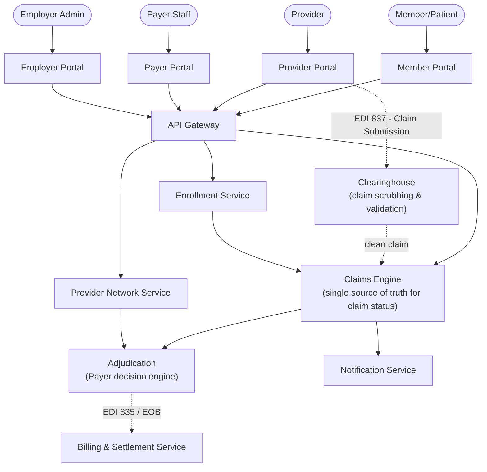
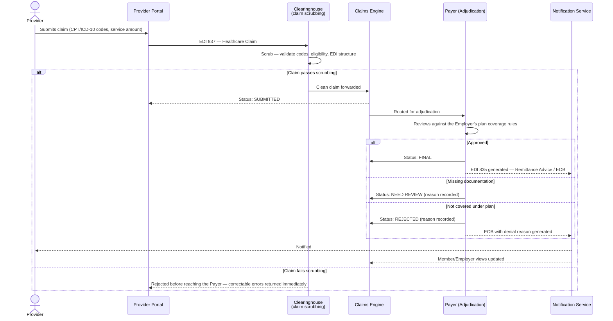
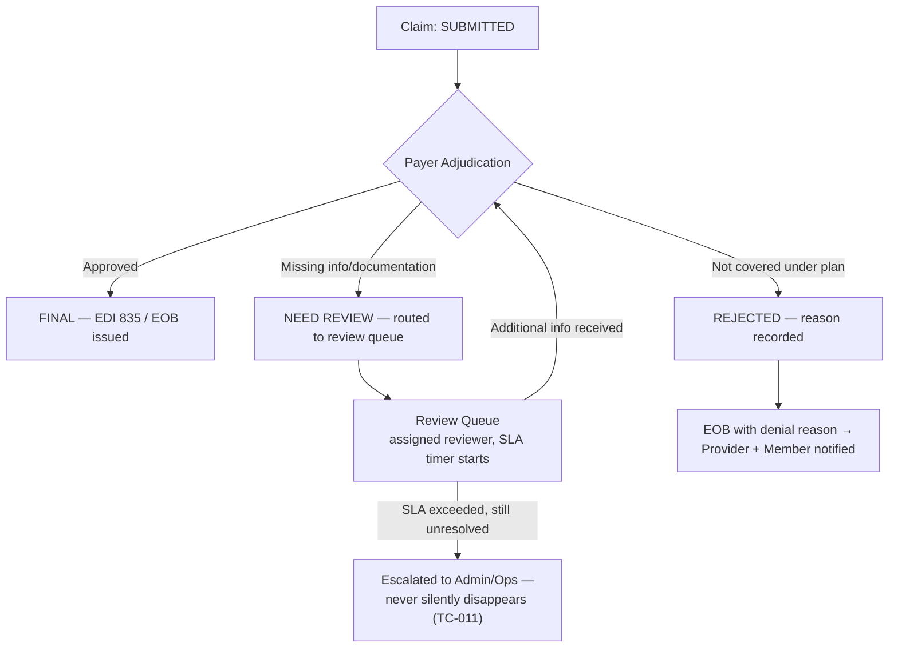
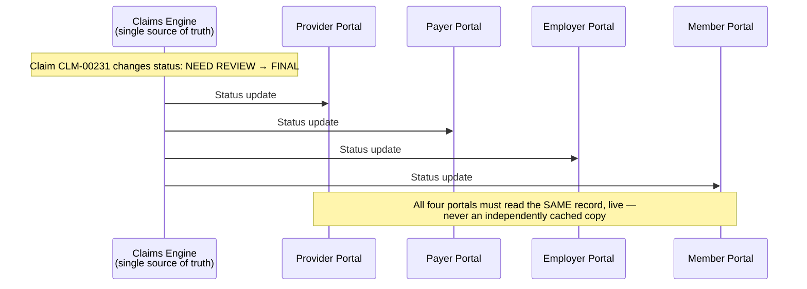
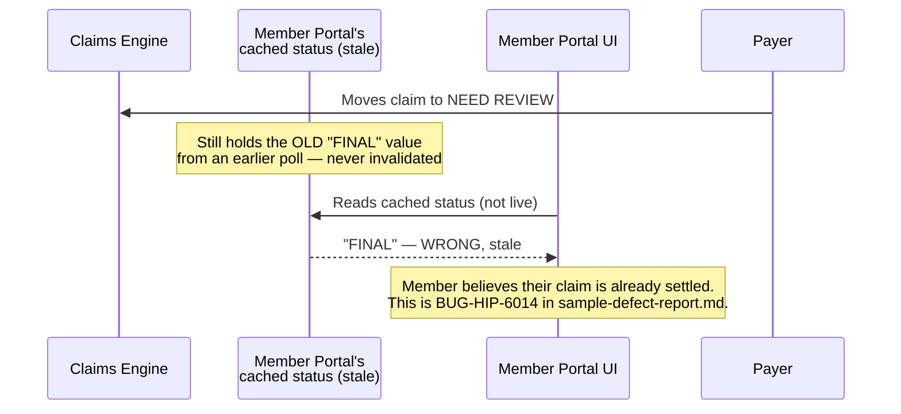

# Healthcare Insurance Platform — Architecture & Flow

> See [`business-overview.md`](./business-overview.md) for why cross-entity consistency is this
> product's central risk, [`tech-and-skills.md`](./tech-and-skills.md) for the tools and skills
> behind this testing approach, and [`README.md`](./README.md) for the full documentation map.
>
> Every diagram below is drawn in [Mermaid](https://mermaid.js.org/), which GitHub renders
> natively in-page — nothing here requires opening another site or tool to read it.

## 1. System Architecture — Who Talks to Whom

**Why the Clearinghouse is its own box, not folded into "Provider submits a claim":** in real
US healthcare claims processing, a claim almost never goes straight from Provider to Payer — it
passes through a clearinghouse that validates and standardizes it first (see section 3 below).
This platform models that same intermediary step deliberately, because a defect in claim
*validation* (wrong code format, missing eligibility check) is a different bug class from a
defect in claim *adjudication* (the Payer's actual coverage decision) — conflating the two into
one generic "claim processing" step would hide which stage actually failed.

**Why the Claims Engine is drawn as the one thing every portal reads from:** per
[`business-overview.md`](./business-overview.md) section 8, it's the single most load-bearing
internal dependency in the whole platform. Every cross-entity consistency guarantee this product
makes depends on all four portals reading the *same* record from this one place — see section 4
below for exactly what goes wrong when a portal doesn't.

## 2. The Real-World Standard Behind This Flow: EDI 837 / 835

This platform's claim lifecycle isn't an invented shape — it mirrors the real electronic claims
standard used across US healthcare, defined under HIPAA's mandated EDI transaction formats:

| Transaction | Direction | Carries |
|---|---|---|
| **EDI 837 (Healthcare Claim)** | Provider → Clearinghouse → Payer | The claim itself: procedure codes (CPT/HCPCS), diagnosis codes (ICD-10), service dates, billed amount |
| **EDI 835 (Healthcare Claim Payment/Advice)** | Payer → Provider (and summarized to Member as an EOB) | The adjudication result: paid/partial/denied, payment amount, adjustment reason codes |

**Why this matters for test design, not just terminology:** a real 837↔835 round trip commonly
takes **7–21 days** in production healthcare systems — which is directly relevant to this
platform's "Need Review must not silently stall" testing principle
([`business-overview.md`](./business-overview.md) section 6). A claim sitting in `NEED REVIEW`
for a few hours in a test environment is normal; the actual regression this platform's QA
strategy watches for is a claim that **never** resolves, not one that simply takes the realistic
multi-day window adjudication genuinely requires.

## 3. Claim Submission & Adjudication Flow

**Key testing principle:** a claim rejected by the **Clearinghouse** (bad code, failed
eligibility check) and a claim rejected by the **Payer** (not covered under the plan) are
different failure modes with different correct UI messaging — one is a Provider data-entry
problem the Provider can fix and resubmit immediately; the other is a coverage decision the
Provider cannot simply "correct." Collapsing both into one generic `REJECTED` status, with no way
to tell them apart, is exactly the kind of ambiguity `TC-007`/`TC-008` in
[`regression-checklist.md`](../regression-checklist.md) exist to catch.

## 4. The `NEED REVIEW` Path — Why It Needs Its Own Diagram

[`business-overview.md`](./business-overview.md) section 6 states the principle ("a Need Review
claim that never resolves is effectively a silently lost claim") in prose. Here's the actual
state path that principle is testing:

**What this diagram makes testable that the prose alone doesn't:** `NEED REVIEW` is not a
terminal state and not an indefinite one — it has a defined exit (back to adjudication once more
information arrives) and a defined failure path (SLA-based escalation) if it doesn't. A test
suite that only checks "does a claim correctly enter `NEED REVIEW`" and never checks "does a
`NEED REVIEW` claim that sits too long actually get escalated" is testing the entry to this state
without ever testing that the state has a real exit — which is precisely the gap `TC-011`
addresses.

## 5. Cross-Entity Consistency — One Claim, Four Views

This is the platform's highest-priority testing theme
([`business-overview.md`](./business-overview.md) section 5,
[`regression-checklist.md`](../regression-checklist.md) section 3), so it gets its own diagram
rather than a bullet point:

### How this actually breaks in production — Defect #1, visualized

[`sample-defect-report.md`](../sample-defect-report.md) Defect #1 is this exact guarantee
failing. Here's the mechanism, shown as a sequence rather than just described:

**Why drawing the actual bug mechanism matters for test design:** the fix
`sample-defect-report.md` proposes — "source live, or with a short bounded cache TTL, from the
same authoritative source" — is only obviously correct once the diagram makes clear *where* the
staleness is introduced (an independent cache the Member Portal owns, not the Claims Engine
itself). A test case written against the prose description alone might only re-check the Member
Portal's display; a test case written against this diagram checks that the **cache itself**
invalidates correctly on a status change, which is the actual root cause, not just the symptom.

## 6. Why This Is Fundamentally a Data-Freshness Problem, Not a UI Bug Class

Every defect theme in [`sample-defect-report.md`](../sample-defect-report.md)'s taxonomy —
stale status, missing rejection reason, plan-rule changes corrupting settled claims — shares one
root shape: **a value computed or cached in one place not staying synchronized with the
authoritative source as that source changes.** This is why
[`business-overview.md`](./business-overview.md) section 5 insists on data-level validation
(querying the Claims Engine's actual record, per `TC-012`–`TC-014`) as a first-class practice
rather than trusting any single portal's UI — a UI assertion alone cannot distinguish "the data
is actually wrong" from "the data is right but this one portal is reading a stale copy of it,"
and those two failure modes need different fixes.

---

**Sources for the real-world standards referenced above** (used to ground this document's flow
in genuine healthcare-claims industry practice):
[EDI 837/835 claims transactions — Nirmitee](https://nirmitee.io/blog/healthcare-edi-835-837-277-developer-guide-claims-integration/),
[Clearinghouse claim scrubbing — AccountableHQ](https://www.accountablehq.com/post/healthcare-clearinghouse-example-how-a-medical-claim-gets-scrubbed-and-sent-to-the-payer),
[HIPAA Security Rule safeguards — CMS](https://www.cms.gov/outreach-and-education/medicare-learning-network-mln/mlnproducts/downloads/hipaaprivacyandsecurity.pdf).
