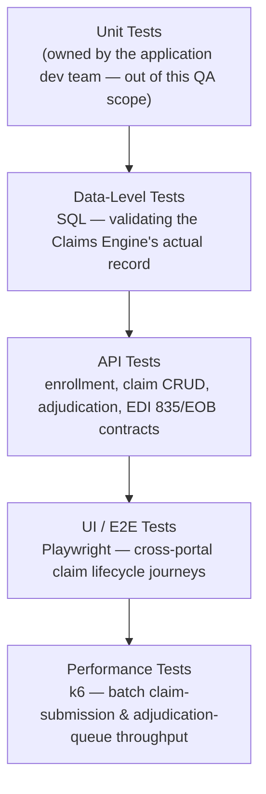
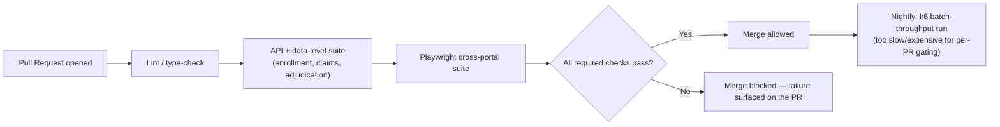

# Healthcare Insurance Platform — Tech Stack & Skills Demonstrated

> Everything in this doc is answerable by reading this repo alone — no need to visit an external
> site to understand what was used or why. See [`business-overview.md`](./business-overview.md)
> for the product/module breakdown and [`architecture-and-flow.md`](./architecture-and-flow.md)
> for how the system actually behaves.

## 1. Full Tech Stack, and Why Each Tool

| Category | Tool | Why This Tool Specifically |
|---|---|---|
| **UI Automation** | Playwright + TypeScript | Native multi-context support — essential here specifically because cross-entity scenarios (a claim submitted as Provider, then adjudicated as Payer, then checked as Member) require driving several isolated browser sessions in one test (see [`../automation/README.md`](../automation/README.md)) |
| **API Testing & Automation** | REST Assured, Postman | Full CRUD validation against the Claims Engine's API — the mechanism behind data-level testing, since the API surface is what lets a test query the *actual* claim record independent of any one portal's UI |
| **Data-Level Testing** | SQL | Direct validation of claim status at the database layer — the only way to confirm the Claims Engine's record (not a portal's rendering of it) is correct, per [`business-overview.md`](./business-overview.md) section 6 |
| **Performance Testing** | k6 | Load/throughput testing for claim-processing volume (section 5 below) — a different performance concern from a race condition, since this platform's risk is sustained batch throughput, not two requests racing for one resource |
| **Bug Tracking & Traceability** | JIRA, RTM | Full defect lifecycle tracking plus requirement-to-test-coverage traceability — see [`sample-rtm.md`](../sample-rtm.md) for a worked example |
| **Process** | Agile/Scrum | Sprint-based delivery — backlog grooming, sprint planning, daily scrum, retrospective, RCA |
| **Version Control** | Git, GitHub | This repo itself; diagrams throughout are Mermaid, which GitHub renders natively with zero extra tooling |

## 2. Skills Demonstrated — Skill → Where to See It

| Skill | Demonstrated By | Where to Look |
|---|---|---|
| **Manual / Functional Testing** | Full enrollment-to-settlement test case suite across all four portals | [`../regression-checklist.md`](../regression-checklist.md) |
| **API Testing** | Full CRUD validation (create/read/update/void) against the Claims API, including business-rule enforcement (e.g., void-after-settlement blocked) | [`../regression-checklist.md`](../regression-checklist.md) section 5 |
| **UI Automation** | Playwright spec covering claim submission, multi-portal status verification, and rejection-reason consistency across isolated browser contexts | [`../automation/sample-claim-lifecycle.spec.ts`](../automation/sample-claim-lifecycle.spec.ts) |
| **API Automation** | The same spec's cross-context assertions double as automated data-consistency checks between what the Payer API records and what the Member-facing read returns | [`../automation/sample-claim-lifecycle.spec.ts`](../automation/sample-claim-lifecycle.spec.ts) |
| **Performance Testing** | k6-based load testing for claim-submission batch throughput and adjudication-queue processing under volume | Section 5 below |
| **Data-Level / Backend Testing** | SQL-based validation of claim records directly, independent of UI display | [`../regression-checklist.md`](../regression-checklist.md) section 4 |
| **Regression Strategy & Prioritization** | A risk-ranked suite with cross-entity consistency explicitly marked highest priority | [`../regression-checklist.md`](../regression-checklist.md) |
| **Requirement Traceability (RTM)** | A worked requirement → test case → status mapping | [`../sample-rtm.md`](../sample-rtm.md) |
| **Defect Management & Root-Cause Analysis** | Worked defect reports identifying the actual mechanism (e.g., "independently cached, never invalidated") not just the symptom | [`../sample-defect-report.md`](../sample-defect-report.md) |
| **Test Reporting & Metrics** | A structured execution summary with pass/fail breakdown by area | [`../regression-execution-summary.md`](../regression-execution-summary.md) |
| **Technical Documentation & Communication** | This entire `docs/` set | This doc set, start to finish |

## 3. The Testing Pyramid Applied to This Project



**Why Data-Level sits just above Unit, below API:** per
[`business-overview.md`](./business-overview.md) section 6, a UI assertion alone can't
distinguish "the data is wrong" from "the data is right but this portal shows a stale copy of
it." Data-level checks against the Claims Engine directly are what make that distinction
possible — which is why they're treated as a dedicated layer here, not folded into API testing.

## 4. CI/CD — Suggested Pipeline Shape

> **Note on scope, matching this repo's existing honesty convention** (see
> [`../automation/README.md`](../automation/README.md)): this repo includes one representative
> Playwright spec rather than a full framework, to stay focused as a portfolio piece. The
> pipeline below is the **intended shape** this automation is designed to slot into — not a claim
> that a live CI instance is currently wired up in this repo.



## 5. Performance Testing, In Depth

This platform's performance risk is **not** a race condition (unlike, say, a seat-inventory
booking system) — a claim doesn't have the same "only one winner" contention a limited-inventory
product does. Its real performance risk is **sustained throughput under batch volume**: claims
arrive in waves (end-of-month billing cycles, open-enrollment season driving a spike in both
enrollments and early claims), and the Claims Engine and Adjudication stage both need to keep up
without queueing indefinitely.

| Test Type | What It Targets | Why It Matters Here Specifically |
|---|---|---|
| **Load test** | Sustained claim-submission volume at an expected peak rate (e.g., a realistic end-of-month EDI 837 batch size) | Confirms the Clearinghouse-scrubbing → Claims Engine intake path keeps pace with normal peak volume without growing a backlog |
| **Spike test** | A sudden surge in claim submissions or status-check traffic | Open enrollment season is a known, recurring spike window for this kind of platform — new enrollments and the first wave of claims under new plans both land in a short window |
| **Soak test** | Sustained moderate adjudication-queue throughput over hours | Catches slow degradation (connection pool exhaustion, a queue consumer falling behind its producer) that a short burst test can't reveal — directly relevant to the `NEED REVIEW` queue's SLA-escalation logic ([`architecture-and-flow.md`](./architecture-and-flow.md) section 4), since a queue that's quietly falling behind under sustained load is indistinguishable from a healthy one in a quick smoke test |
| **Portal response-time test** | Concurrent read load across all four portals during a status-change event (e.g., a mass notification after a plan-wide rule update) | A notification that prompts many Members to check status simultaneously is a realistic read-heavy spike distinct from the write-heavy claim-submission spike above |

**A concrete, illustrative k6 load-test scenario** — batch claim-submission throughput:

```javascript
// k6/claim-submission-batch-load.js — illustrative shape, dummy data only
import http from 'k6/http';
import { check, sleep } from 'k6';

export const options = {
  scenarios: {
    end_of_month_batch: {
      executor: 'ramping-vus',
      startVUs: 0,
      stages: [
        { duration: '2m', target: 50 },   // ramp to 50 concurrent Provider submissions
        { duration: '5m', target: 50 },   // hold — simulates sustained batch volume
        { duration: '2m', target: 0 },    // ramp down
      ],
    },
  },
  thresholds: {
    http_req_duration: ['p(95)<1500'],     // 95% of submissions scrubbed+intaken under 1.5s
    http_req_failed: ['rate<0.01'],        // under 1% failure rate during sustained load
  },
};

export default function () {
  const res = http.post('https://demo-env/api/claims', JSON.stringify({
    memberId: 'DEMO-MEMBER-001',
    providerId: 'DEMO-PROVIDER-001',
    procedureCode: 'DEMO-CPT-001', // illustrative — not a real CPT code
    amount: 250,
  }), { headers: { 'Content-Type': 'application/json' } });

  check(res, { 'claim accepted for scrubbing': (r) => r.status === 202 || r.status === 201 });
  sleep(1);
}
```

**What this script is actually proving:** not "does one request succeed" (that's the functional
suite's job) but whether the Clearinghouse-scrubbing → Claims Engine intake path holds its P95
latency and error-rate targets under a realistic sustained submission rate — the exact question
that matters for an end-of-month batch window, and one no single-request functional test can
answer by itself.

## 6. Real-World Grounding — Industry Context

This project's claim flow and terminology are deliberately grounded in how real US healthcare
claims processing works, not invented for the portfolio — see
[`architecture-and-flow.md`](./architecture-and-flow.md) section 2 for the full EDI 837/835
mapping, and section 8 of [`business-overview.md`](./business-overview.md) for how HIPAA's
Security Rule (administrative, physical, and technical safeguards over ePHI) applies to a
platform holding exactly this kind of claim and Member data.

**Sources:**
[EDI 837/835 claims transactions — Nirmitee](https://nirmitee.io/blog/healthcare-edi-835-837-277-developer-guide-claims-integration/),
[Clearinghouse claim scrubbing — AccountableHQ](https://www.accountablehq.com/post/healthcare-clearinghouse-example-how-a-medical-claim-gets-scrubbed-and-sent-to-the-payer),
[HIPAA Security Rule safeguards — CMS](https://www.cms.gov/outreach-and-education/medicare-learning-network-mln/mlnproducts/downloads/hipaaprivacyandsecurity.pdf).
